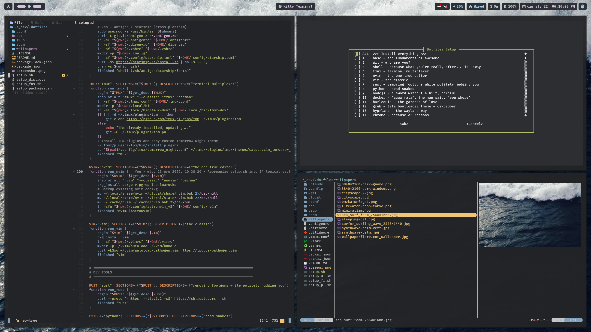

# .dotfiles



> zsh + starship + tmux + astronvim + tomorrow night

---

Because you ain't got time for setting up a fresh system by yoself

## What's This?

This repository contains all the secret sauces that make my Linux environment feel like home sweet home. From zsh configurations to Vim plugins, from colorful terminal themes to productivity-boosting aliases, it's all here!

## What's inside?

## How to Use

### Step 1: Clone the Repository
```bash
git clone git@github.com:jhnwsk/.dotfiles.git ~/.dotfiles
```

### Step 2: Run the Setup Script
```bash
cd ~/.dotfiles
./setup.sh
```

And voilà! Sit back, relax, and watch the magic unfold as the script sprinkles fairy dust and sets up your Linux environment just the way you like it. ✨✨

## But Wait, There's More!

### Customize to Your Heart's Content
Feel free to tweak, twist, and turn the configurations to match your personality. After all, it's your Linux kingdom, and you're the king/queen/overlord of customization!

### Issues? Bugs? Suggestions?
If you stumble upon a bug, an issue, or have a suggestion to make this setup even more enchanting, don't hesitate to open an issue or pull request. Let's make Linux land even more whimsical together!

### Spread the Magic
If you find this repository helpful, feel free to share the love. After all, sharing is caring, and every Linux user deserves a dash of magic in their lives! 🌟

## Credits
This project wouldn't be possible without the amazing open-source community and the countless hours spent on Stack Overflow. Kudos to all the wizards and sorceresses out there!

## Handy Links
- [How to customize GRUB](https://www.linuxtechmore.com/2024/05/how-to-customize-grub.html)
- Too lazy to type passwords, but got a fingeprint sensor? `sudo pam-auth-update` for glory!
- [Audacity](https://www.audacityteam.org/) for audio editing pleasure.
- [vokoscreenNG](https://linuxecke.volkoh.de/vokoscreen/vokoscreen.html) if gnome-screenshot is not enough
- [OpenShot](https://www.openshot.org/) is iMovie but bet... a bit worse.
- [Remmina](https://remmina.org/) is a great remote desktoper.
- Install [nerdfonts](https://github.com/getnf/getnf) like a champ!

---
